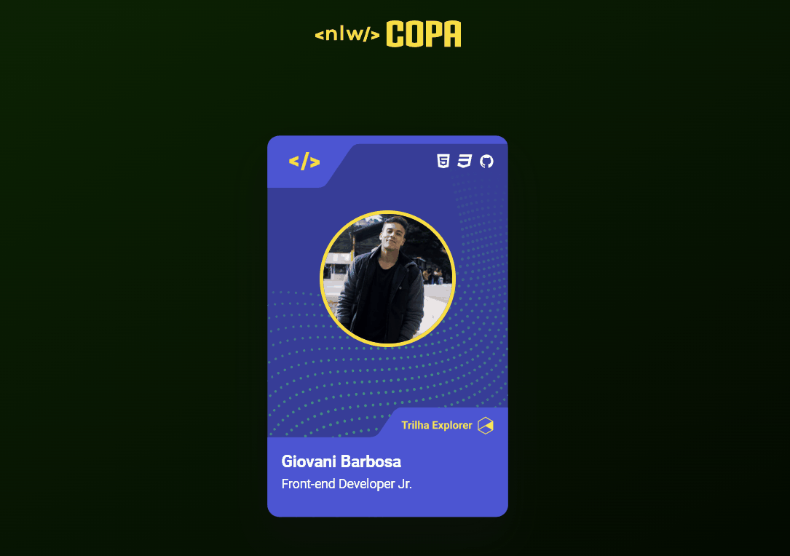

# Projeto mini portfolio
<a href="https://barbosagio.github.io/nlw-card-world-cup/" target="_blank">Clique aqui para acessar</a>

## Overview
### O projeto
Um projeto realizado junto a Rocketseat. 
A intenção do projeto é criar uma figurinha do design da nlw da própria Rocketseat. Com a interação de mudar o design da mesma após o clique.

### Screenshot

## Meu processo
### Construção
- Análise do design no Figma;
- Exportação de arquivos não dinâmicos em svg. para facilitar a construção da aplicação;
- Criação do HTML e sua estrutura;
- Link dos arquivos CSS (style, reset);
- Estilização dos elementos HTML;
- Interação a partir do clique para mudar o design da figurinha.

## Programas utilizados
- HTML5
- CSS
- JavaScript
- Figma